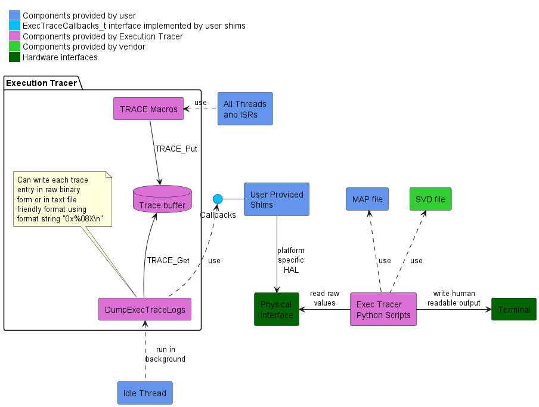
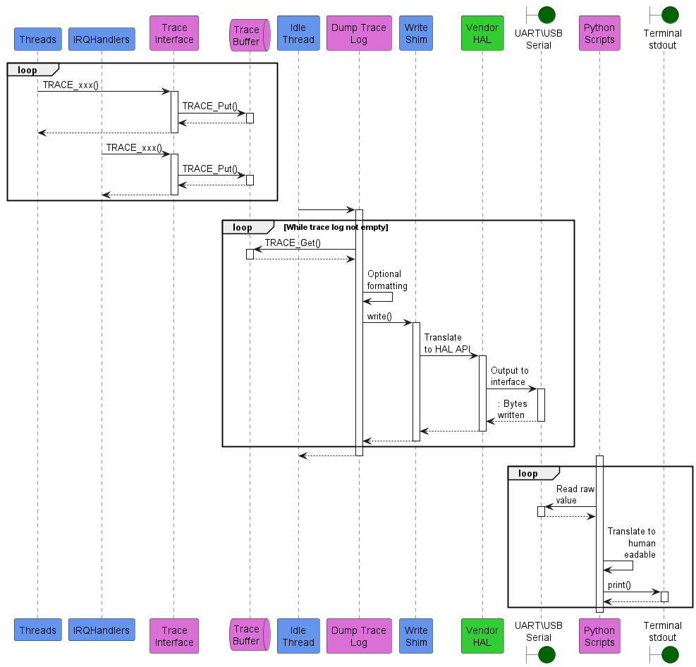

# Execution Tracer

## Overview

Execution Tracer is a flexible, minimalist, low overhead and open-source tool to help you understand the sequencing of your programs.  It is designed to be usable on any system with a minimum amount of effort and without any extra hardware.  You decide what to trace by placing TRACE macros throughout your program.  Unlike conventional logging macros, these TRACE macros are lightweight, incurring minimal CPU overhead.

## Status

This project is in alpha stage.  More work is needed in terms of baseline functionality, example code and basic documentation.  At that time it will transition to beta stage and open to early collaborators.  No there is no time estimate for transition to beta stage.

## Documentation Updates

UML diagrams in this document are made using [PlantUML](https://plantuml.com/). Source files reside under `doc/images/src` and rendered image files go under `doc/images/out`. It is recommended but not necessary to use the VS Code [Plant UML extension](https://marketplace.visualstudio.com/items?itemName=jebbs.plantuml). If you open this project in VS Code, the PlantUML extension will be recommended automatically. All rendered images can be updated using "PlantUML: Export Workspace Diagrams" from the command palette.

Alternatively, PlantUML can be run locally. Instructions for local installation of PlantUML are [here](https://plantuml.com/starting). If run locally, output paths must follow the same convention outlined by the `plantuml` settings in `.vscode/settings.json`.

> __Note:__ In the interests of platform-agnosticism and full CLI support, future development of this project may transition to script-based updates of documentation along with a corresponding `make` target.

> __Note:__ This project intentionally _does not_ use the inlined form of PlantUML source in Markdown docs since feature relies on support from each SaaS vendor (e.g. GitHub, GitLab, etc.) and is therefore not portable.

## Theory of Operation

### Discussion

The following diagram shows the general theory of operation.

The main concept is a circular trace buffer and a set of macros to write to it.  The macros must complete as fast as possible.  Forwarding of trace buffer values to a physical interface is done later and in the background, typically by the Idle thread.

The trace log is in a raw binary format.  Effective processing requires a MAP file and possibly an SVD file.  Future work may also make use of the ELF file (with DWARF info).  This means you must preserve the build artifacts for the firmware image being analyzed.  Processing is always done off-target and is handled via cross-platform Python scripts.

For the on-target code, the TRACE macros can be considered the front end. Everything between the write shim and the physical interface can be considered the back end. The interface choice is up to the developer and is outside the scope of Execution Tracer. Possibilities for the back end include:

- Have a background thread deliver raw contents in real time to RTT, SWO or serial port.
  - Save this stream to a file for processing later.
  - Process this stream in real time with the Python script.
- Snapshot the buffer after a crash or hard fault.
  - Save this snapshot to flash or RAM.
  - Offload the snapshot later as part of a crashlytics report.

### Example Sequence Diagram

This diagram shows a configuration streaming trace data in real time over UART to a PC. Note that although the three loops are staggered in the diagram, they are in fact all running simultaneously.

- Various threads and ISRs are writing entries to the trace buffer via the `TRACE` macros.
- The Idle thread is offloading the trace buffer and forwarding these entries to the write shim.
- The write shim provides the glue logic to write the entries out the selected UART.
- The Python scripts are listening on the associated COM port or tty device and translating the trace entries to human-readable format in real time.

## Goals

- Device and toolchain agnostic
  - There is currently a compromise on this front for rendering of PlantUML documents in VS Code
- Development platform agnostic
- Simple to use (low learning curve)
- Lightweight enough to pull into any project
- No special equipment or software license required
- Powerful and flexible enough to be helpful for most problems
- Provide critical insight necessary for the truly difficult bugs (deadlocks, race conditions, etc.)
