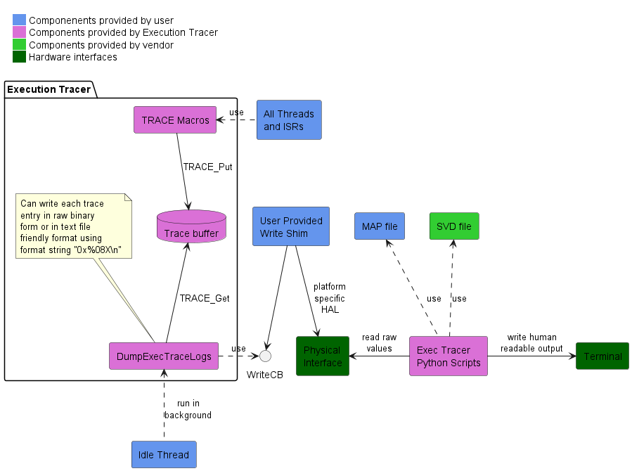

# Execution Tracer

## Overview

Execution Tracer is a flexible, minimalist, low overhead and open-source tool to help you understand the sequencing of your programs.  It is designed to be usable on any system with a minimum amount of effort and without any extra hardware.  You decide what to trace by placing TRACE macros throughout your program.  Unlike conventional logging macros, these TRACE macros are lightweight, incurring minimal CPU overhead.

## Status

This project is in alpha stage.  More work is needed in terms of baseline functionality, example code and basic documentation.  At that time it will transition to beta stage and open to early collaborators.  ETA for beta stage is sometime May 2023.

## Theory of Operation

The following diagram shows the general theory of operation.

The main concept is a circular trace buffer and a set of macros to write to it.  The macros must complete as fast as possible.  Forwarding of trace buffer values to a physical interface is done later and in the background, typically by the Idle thread.

The trace log is in a raw binary format.  Effective processing requires a MAP file and possibly an SVD file.  Future work may also make use of the ELF file (with DWARF info).  This means you must preserve the build artifacts for the firmware image being analyzed.  Processing is always done off-target and is handled via cross-platform Python scripts.

"Physical interface" here is open to interpretation.  It could be a direct serial interface such as UART or RTT, an RF interface such as BLE or even a storage medium such as flash.  How the trace values get from the "write shim" to the Python scripts is up to the developer.

## Goals

- Device and toolchain agnostic
- Development platform agnostic
- Simple to use (low learning curve)
- Lightweight enough to pull into any project
- No special equipment or software license required
- Powerful and flexible enough to be helpful for most problems
- Provide critical insight necessary for the truly difficult bugs (deadlocks, race conditions, etc.)
